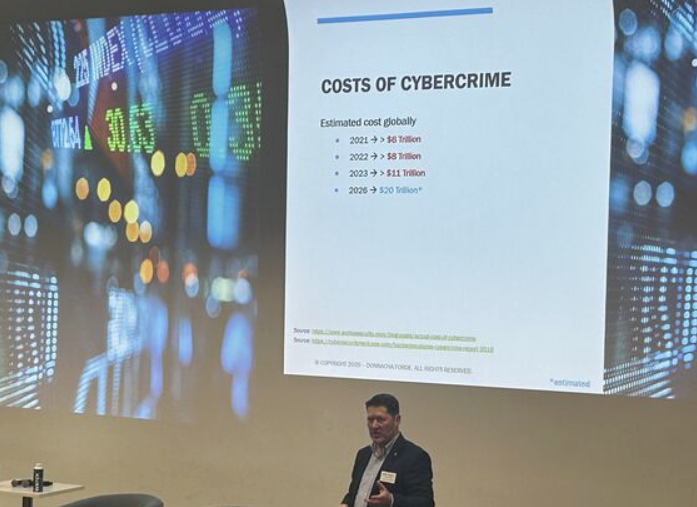

### Donnacha Forde

Senior technical leader, architect, and strategist - 36 years building distributed systems, the last decade at the intersection of cybersecurity and engineering leadership.

**Focus areas:** Cybersecurity - Identity & Access Management - Distributed Systems - Endpoint Detection & Response - Secure Communications

I guest lecture on cybersecurity and software architecture, and have spoken at conference sessions on security engineering topics. The through-line is connecting distributed systems thinking to the practical realities of building secure, scalable software - drawing directly from architecture decisions made at commercial scale, at McAfee on EDR and MITRE ATT&CK, at CrowdStrike's Office of the CTO and currently at Cerby on Zero Trust connectivity.

Most production work lives in private repos - commercial and security constraints apply. What's public here is tooling, design patterns and examples that reflect how I approach engineering problems.

**Start here:**
- [donnachaforde.github.io](https://donnachaforde.github.io) - architectural writing, JVM performance deep-dive series, and MSc lecture content
- [LinkedIn](https://www.linkedin.com/in/donnachaforde/) - full career track and contact
- [espresso-tools](https://github.com/donnachaforde/espresso-tools) - a collection of useful CLI tools, built using the espresso library (C++)
